# Pharma MMM Agent - Architecture & Workflow Diagrams

## High-Level Architecture

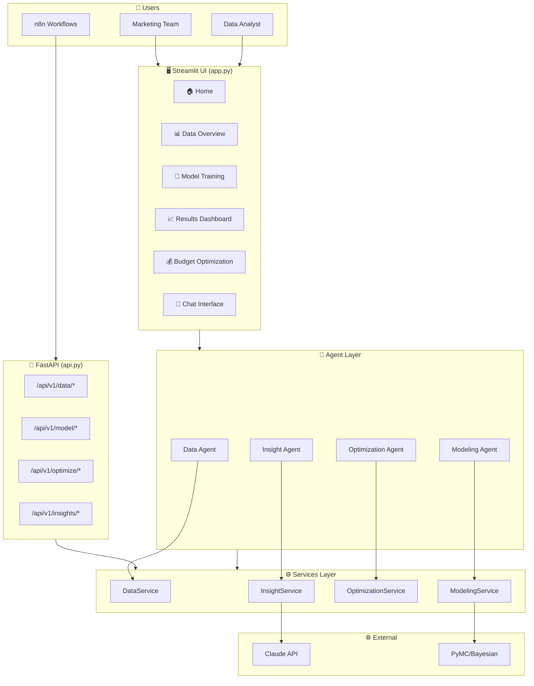

## User Journey Flow

```mermaid
flowchart LR
    subgraph Step1["1️⃣ Data Ingestion"]
        Upload["Upload CSV/Excel"]
        Generate["Generate Sample Data"]
        Validate["Validate Data"]
    end

    subgraph Step2["2️⃣ Data Exploration"]
        Summary["View Summary Stats"]
        TimeSeries["Analyze Time Series"]
        Correlations["Check Correlations"]
    end

    subgraph Step3["3️⃣ Model Training"]
        Config["Configure Model"]
        Train["Train Bayesian MMM"]
        Diagnostics["Check Diagnostics"]
    end

    subgraph Step4["4️⃣ Results Analysis"]
        Contributions["Channel Contributions"]
        ROI["ROI Analysis"]
        ResponseCurves["Response Curves"]
    end

    subgraph Step5["5️⃣ Optimization"]
        SetBudget["Set Total Budget"]
        Constraints["Define Constraints"]
        Optimize["Run Optimization"]
    end

    subgraph Step6["6️⃣ Insights"]
        QA["Ask Questions"]
        Summary2["Get Summaries"]
        Report["Generate Reports"]
    end

    Step1 --> Step2 --> Step3 --> Step4 --> Step5 --> Step6
```

## Streamlit UI Pages

```mermaid
flowchart TB
    subgraph App["📱 Streamlit Application"]
        direction TB

        subgraph HomePage["🏠 Home Page"]
            Welcome["Welcome & Overview"]
            QuickStart["Getting Started Guide"]
            Features["Feature Highlights"]
        end

        subgraph DataPage["📊 Data Overview Page"]
            direction LR
            Upload2["File Upload"]
            Validation["Data Validation"]
            Preview["Data Preview"]
            Viz["Visualizations"]
        end

        subgraph ModelPage["🧮 Model Training Page"]
            direction LR
            AdstockConfig["Adstock Settings"]
            SatConfig["Saturation Settings"]
            MCMCConfig["MCMC Settings"]
            TrainBtn["Train Model"]
        end

        subgraph ResultsPage["📈 Results Dashboard"]
            direction LR
            Waterfall["Waterfall Chart"]
            ContribPie["Contribution Pie"]
            ROIBars["ROI by Channel"]
            Coefficients["Coefficients"]
        end

        subgraph OptPage["💰 Budget Optimization"]
            direction LR
            CurrentAlloc["Current Allocation"]
            Constraints2["Set Constraints"]
            OptResults["Optimized Results"]
            Scenarios["Scenario Analysis"]
        end

        subgraph ChatPage["💬 Chat Interface"]
            direction LR
            QuickActions["Quick Actions"]
            ChatHistory["Chat History"]
            QAInput["Question Input"]
        end
    end

    HomePage --> DataPage
    DataPage --> ModelPage
    ModelPage --> ResultsPage
    ResultsPage --> OptPage
    OptPage --> ChatPage
```

## Services Layer Detail

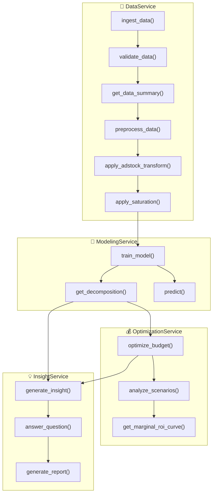

## Bayesian MMM Model Flow

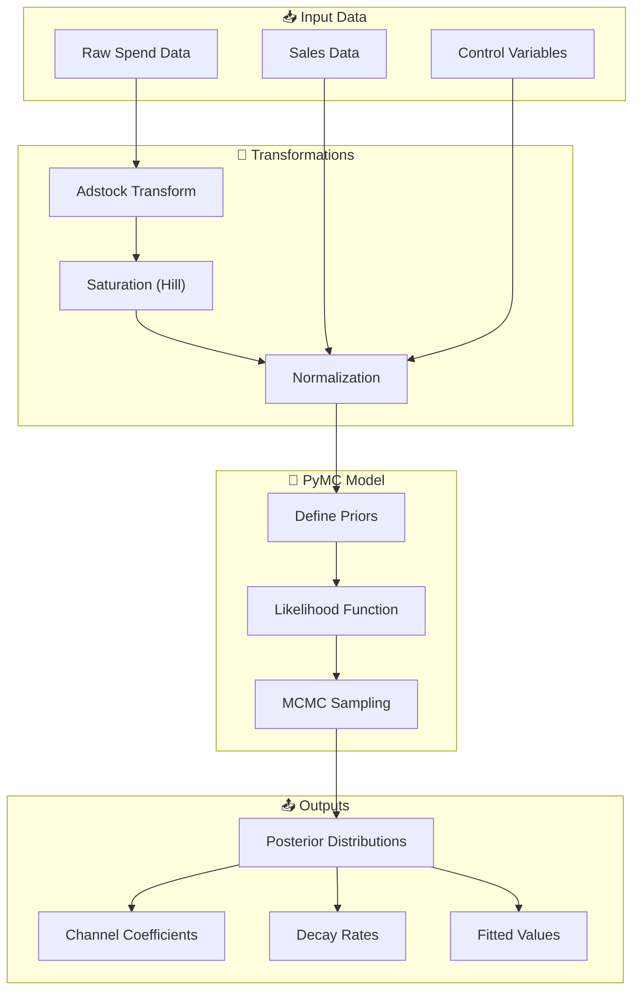

## Adstock & Saturation Transformations

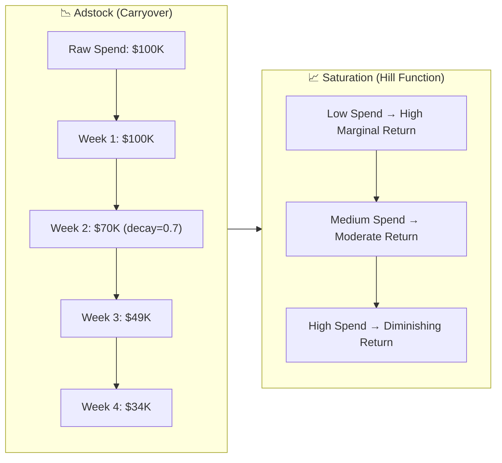

## FastAPI Endpoints

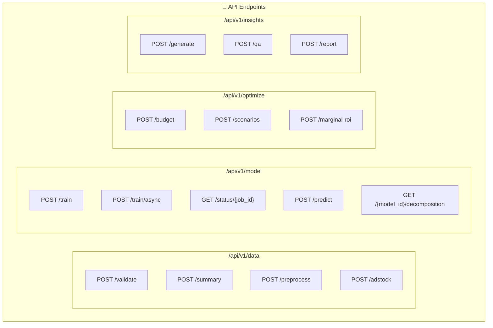

## n8n Workflow Integration

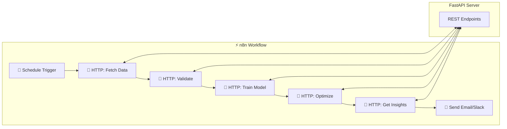

## Channel Contribution Decomposition

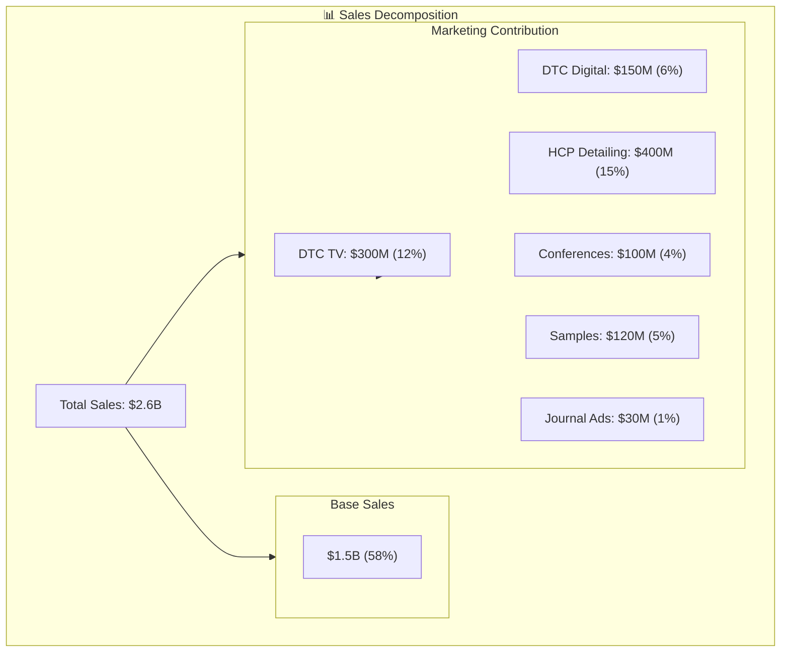

## Budget Optimization Flow

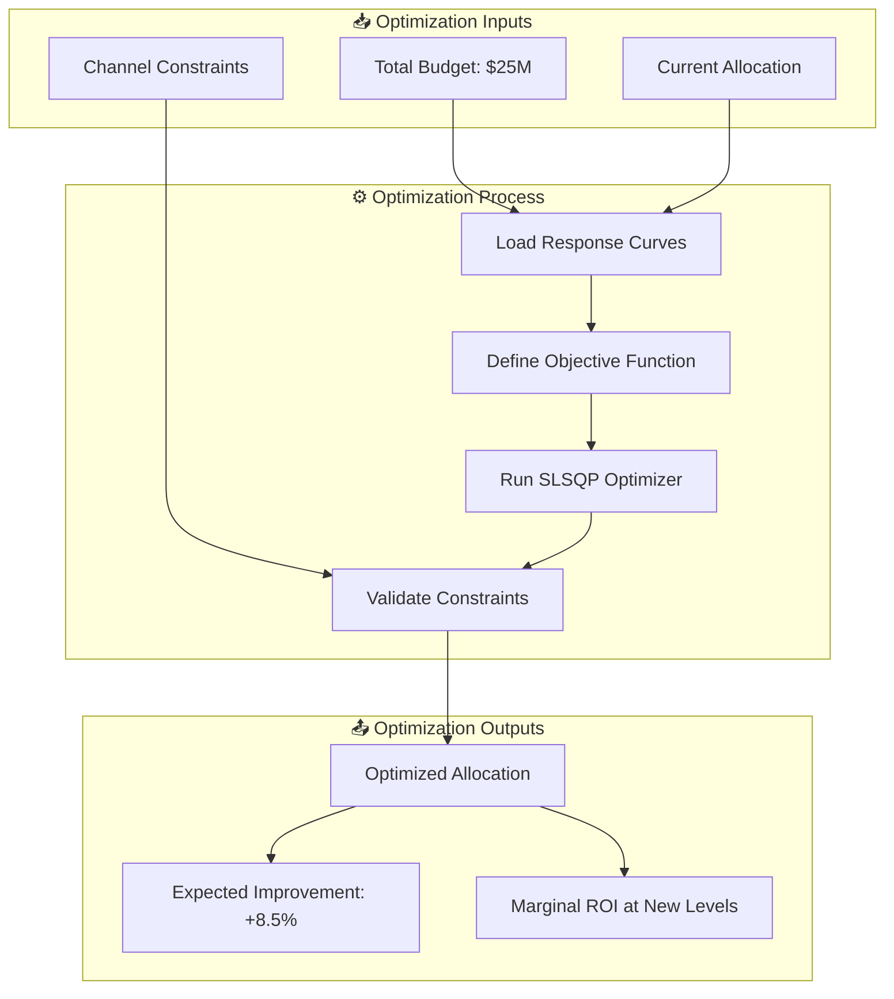

## Data Flow Summary

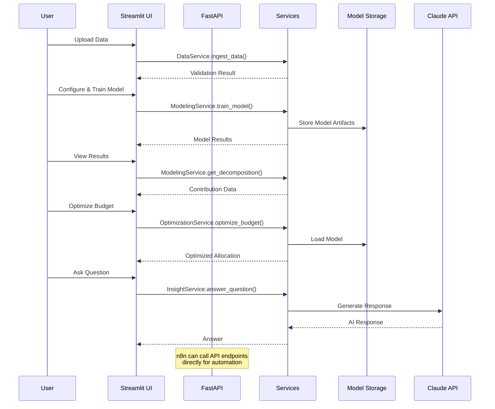

---

## Viewing These Diagrams

These diagrams use [Mermaid](https://mermaid.js.org/) syntax. To view them:

1. **GitHub**: Renders automatically in markdown files
2. **VS Code**: Install "Markdown Preview Mermaid Support" extension
3. **Online**: Paste into [Mermaid Live Editor](https://mermaid.live/)
4. **Streamlit**: Use `streamlit-mermaid` package

## Quick Reference

| Component | Purpose | Key Files |
|-----------|---------|-----------|
| Streamlit UI | Interactive web app | `app.py`, `src/ui/pages/*.py` |
| FastAPI | REST API for n8n | `api.py` |
| DataService | Data ingestion/validation | `src/services/data_service.py` |
| ModelingService | Bayesian MMM training | `src/services/modeling_service.py` |
| OptimizationService | Budget optimization | `src/services/optimization_service.py` |
| InsightService | Claude-powered insights | `src/services/insight_service.py` |
| Agents | Task coordination | `src/agents/*.py` |
